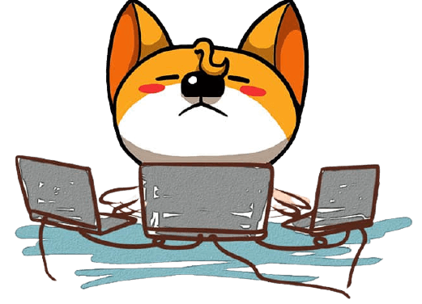

<!-- banner -->

  

    <h1 style="font-size: 3.5rem;;font-weight:600;text-shadow:4px 4px 6px #eee;">Jonsam Ng</h1>
    <h2 style="font-size:14px;border-left:3px solid #fff;padding:0;padding-left:1.5rem;">💒&nbsp;坐标西安 🦄&nbsp;前端开发者</h2>
  

  

<!--
- 🔭 I’m currently working on ...
- 🌱 I’m currently learning ...
- 👯 I’m looking to collaborate on ...
- 🤔 I’m looking for help with ...
- 💬 Ask me about ...
- 📫 How to reach me: ...
- 😄 Pronouns: ...
- ⚡ Fun fact: ...
-->
