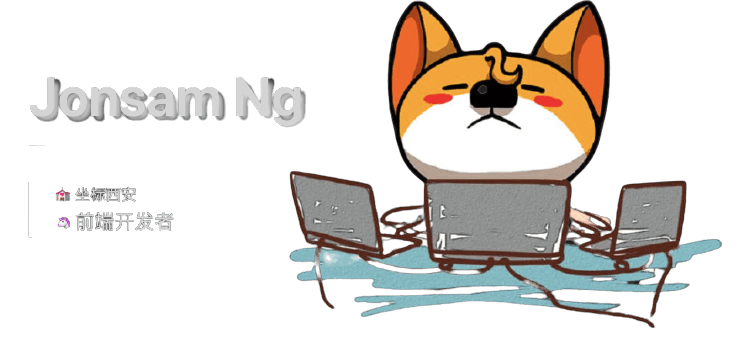

<!-- banner -->

----

Hi, I'm jonsam ng, a web developer from Xi'an, China.I am on React and Typescript.

## My blog website

👉 [夏夜•梦无眠](https://www.jonsam.site/)

## Blogs recently

👉 [My Blogs recently](./articles.md)

## Things recently

- Read source code of front end.
- Webrtc learning roadmap.
- Things of basic machine learnning.
- Sharing good books and reading.

## Things I code with

  
   
  
  
  
  
  
  
  
  
  
  
  

## Github stats :bar_chart:

### Visitor's count :eyes:

### Top langs :tongue:

### Profile stats :musical_keyboard:

